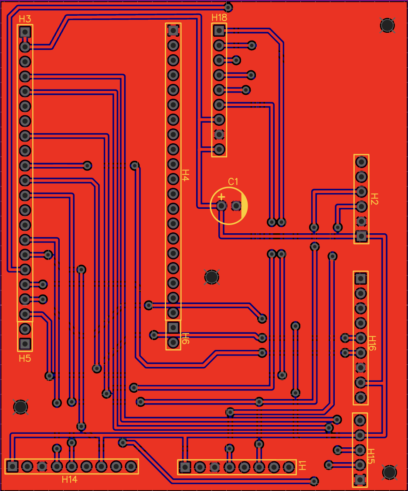
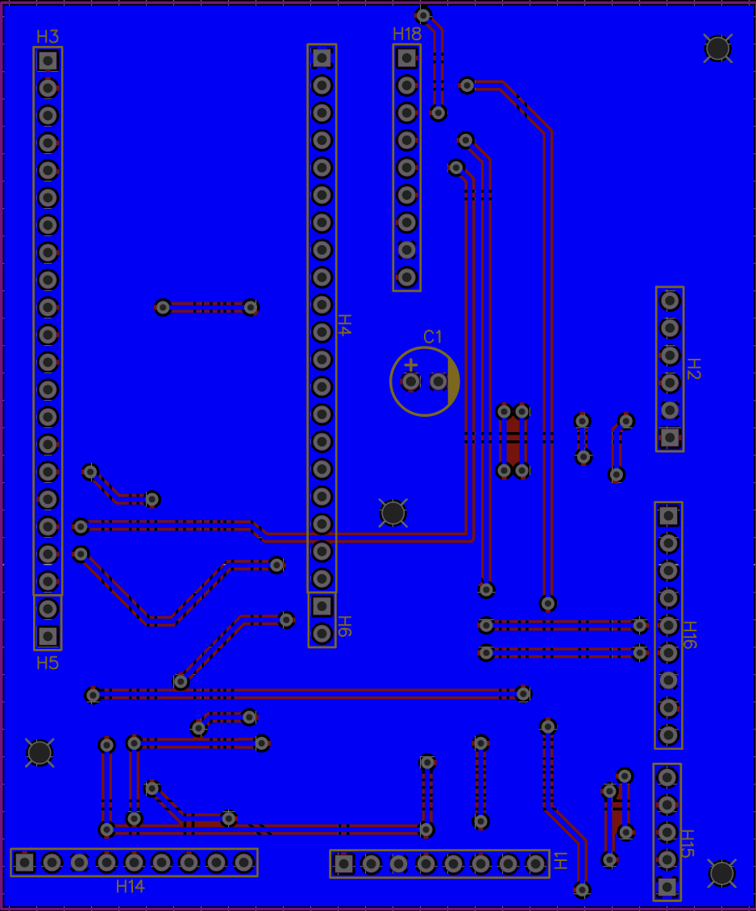
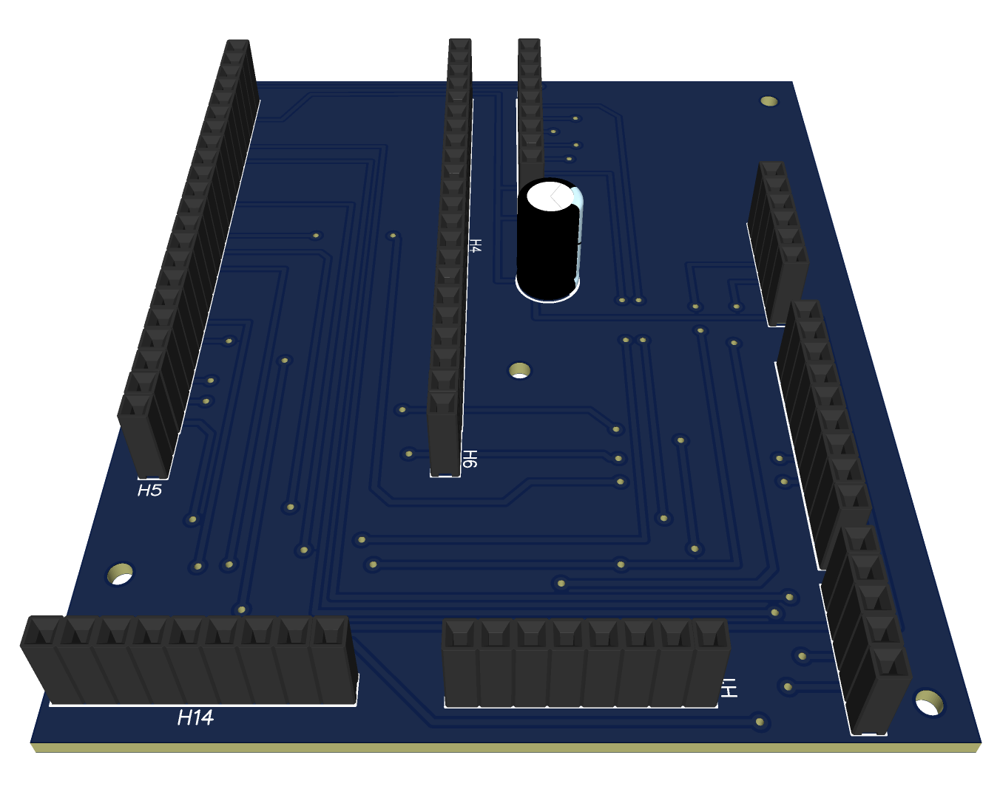
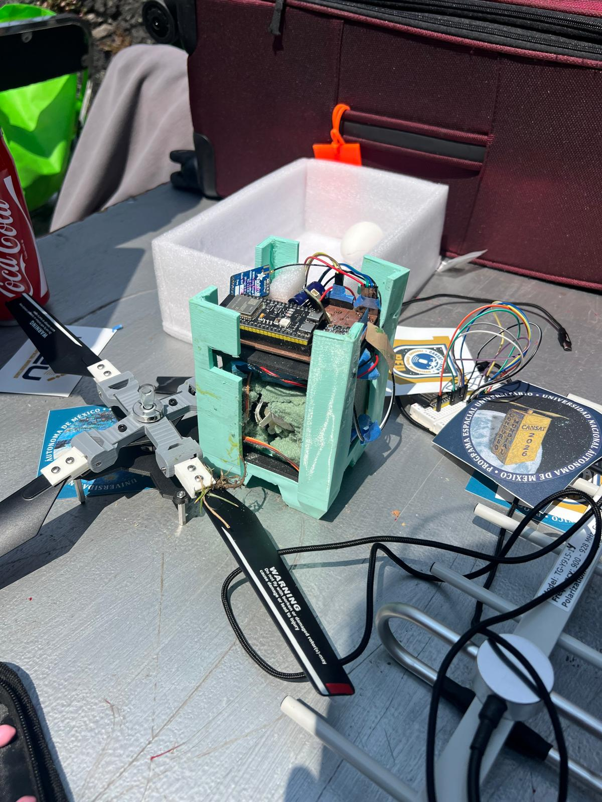

# CanSat 2026 Flight Computer

Custom flight computer developed for the PEU UNAM CanSat 2026 competition.

The board served as the primary avionics system of the CanSat, responsible for environmental sensing, flight data collection, telemetry transmission, and mission monitoring throughout flight operations.

---

## Mission

The flight computer was designed to:

- Collect environmental and flight data
- Process sensor measurements in real time
- Transmit telemetry to the ground station
- Operate reliably throughout launch, descent, and landing

---

## Hardware

### Main Components

- ESP32 Microcontroller
- LSM9DS1 IMU
- TMP117 Temperature Sensor
- DPS310 Pressure Sensor
- RFM69HCW LoRa Radio

---

## PCB Design

### Top Layer

  

The top layer contains the ESP32 microcontroller, sensors, LoRa transceiver, and supporting circuitry required for flight operations.

### Bottom Layer

  

The bottom layer was primarily used for routing, power distribution, and signal interconnections.

### 3D Model

  

3D rendering of the flight computer generated in EasyEDA prior to fabrication.

---

## Competition

The project was developed by the John Brown University Golden Eagles team for the PEU UNAM CanSat 2026 competition held in Mexico City, Mexico.

The system successfully completed flight operations and telemetry transmission during the mission.

### Telemetry Performance

- 135 packets transmitted
- 128 packets received
- 7 packets lost

### CanSat After Landing

  

---

## Team

### John Brown University Golden Eagles

- Evan Jenkins
- Michael Salvatierra
- Hasly Perez
- Luke Main
- Luis Chojolan
- Roberto Martinez
- Iker Garcia Morales

---

## Lessons Learned

This project provided practical experience in:

- PCB Design
- Sensor Integration
- Embedded Systems
- RF Telemetry
- System Level Engineering
- Hardware Debugging and Validation

One of the most important lessons was designing for reliability and testability. Connector placement, debugging access, subsystem integration, and field validation became critical factors during development and mission preparation.

---

## My Contributions

As part of the CanSat project, I was responsible for the design and development of the flight computer hardware.

My contributions included:

- Designing the flight computer PCB
- Selecting and integrating sensors and communication hardware
- Integrating the ESP32 microcontroller, IMU, temperature sensor, pressure sensor, and LoRa transceiver
- Performing PCB validation and hardware testing
- Supporting system integration and mission preparation

---

## Portfolio

More details about the project can be found here:

https://ikeermora.github.io/portfolio/projects/cansat-flight-computer.html
